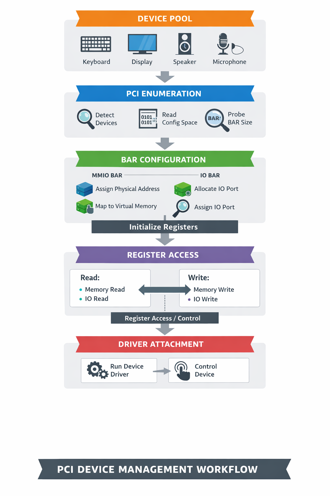

# 🧠 PCI Device Simulation & Enumeration (Mini OS Hardware Layer)

This project is a **low-level simulation of a PCI subsystem**, designed to mimic how an operating system discovers, configures, and communicates with hardware devices.

It models key concepts such as:
* PCI configuration space
* BAR (Base Address Register) handling
* MMIO vs IO space
* Device enumeration
* Basic driver attachment

---

## 🚀 Features

### PCI Device Simulation
* Fake PCI devices with:
  - Vendor ID / Device ID
  - Class & Subclass
  - Config space structure
* Multiple devices registered in a global device pool

###  BAR (Base Address Register) Handling
* Supports:
  - MMIO (Memory-Mapped I/O)
  - IO Port-based devices
  - 32-bit and 64-bit BARs
* Implements:
  - BAR size probing (real PCI technique)
  - Address assignment
  - Virtual memory mapping

### PCI Enumeration
Simulates how an OS discovers devices:
1. Scan device list
2. Read config space
3. Detect valid devices
4. Probe BAR sizes
5. Allocate address space
6. Map to virtual memory
7. Enable device (command register)

### Device Communication Layer
Unified API for interacting with devices:
```c
ReadDeviceReg()
WriteDeviceReg()
```
Internally handles:
* IO space access
* MMIO memory access

### Fake Hardware Register Model
Each device exposes registers:
```c
#define REG_STATUS
#define REG_CONTROL
#define REG_DATA
```
Simulates:
* Device start command
* Status updates
* Data transfer

### Basic Driver Model
Simple driver attachment based on class code:
`AttachDriver()`
Drivers interact with devices via:
`TestDevice()`

---

## Architecture diagram
### PCI Enumeration Flow


---

## Future Improvements

### Driver System
* Replace AttachDriver() with:
  - Driver registry
  - Vendor/device matching

### DMA Simulation
* Device writes directly to memory

### Realistic PCI Bus
* Bus / Device / Function addressing

### Interrupt Support
* Simulate IRQ
* Device → CPU signaling

---

## 🧠 Learning Goals

This project helps understand:
* How OS detects hardware?
* How devices expose resources (BARs)?
* Difference between IO and MMIO?
* How drivers communicate with hardware?
* Low-level memory and register access?

---

## Summary
This is not just a simulation — it is a **mini hardware abstraction layer** similar to what real kernels implement during early boot.
